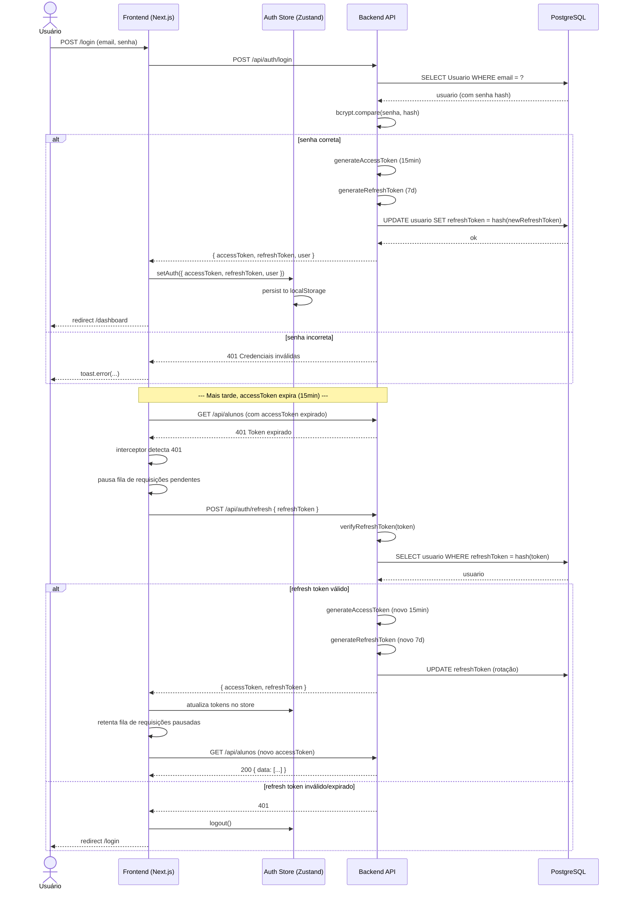
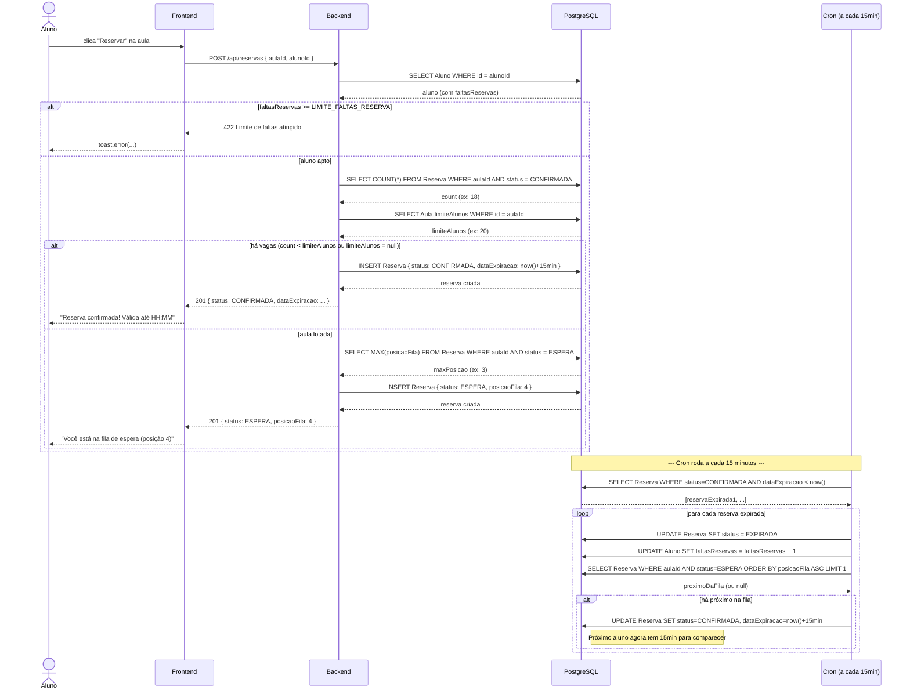
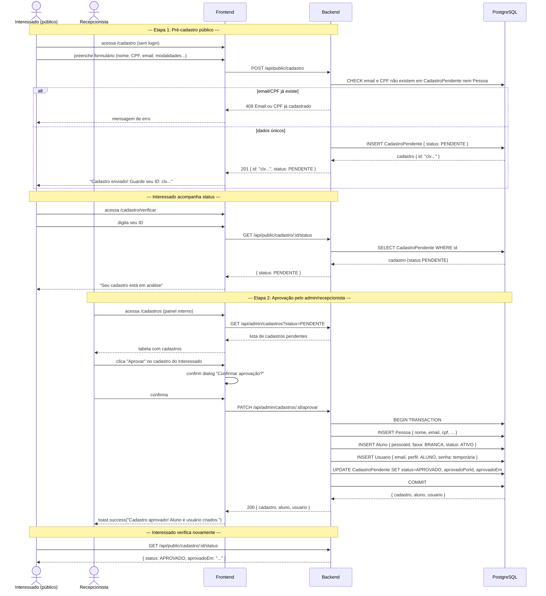
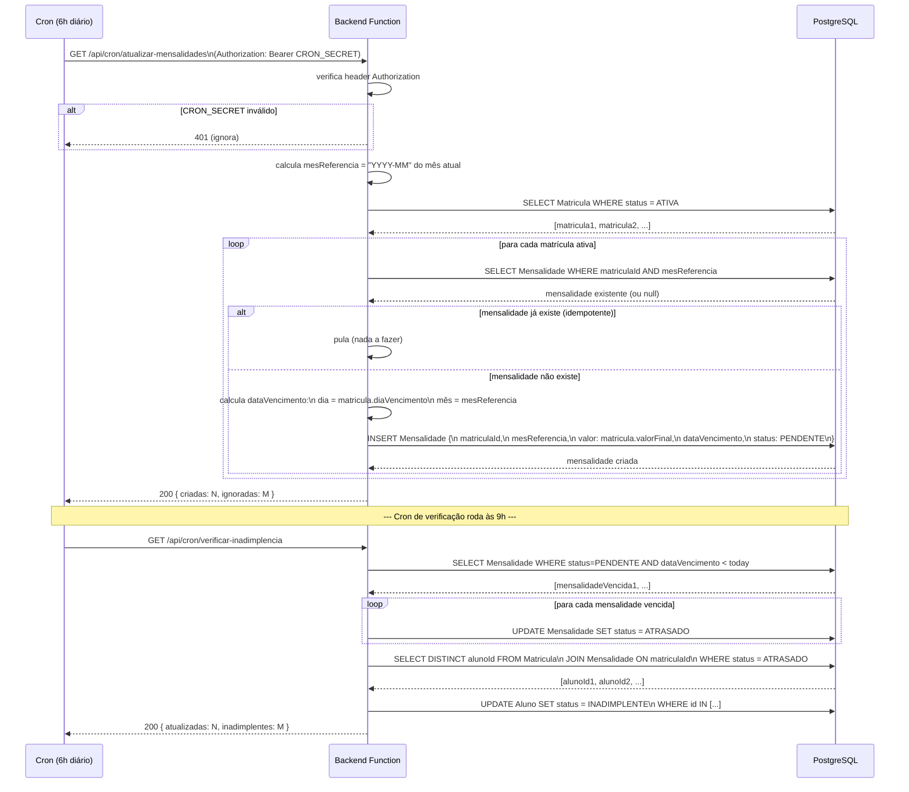
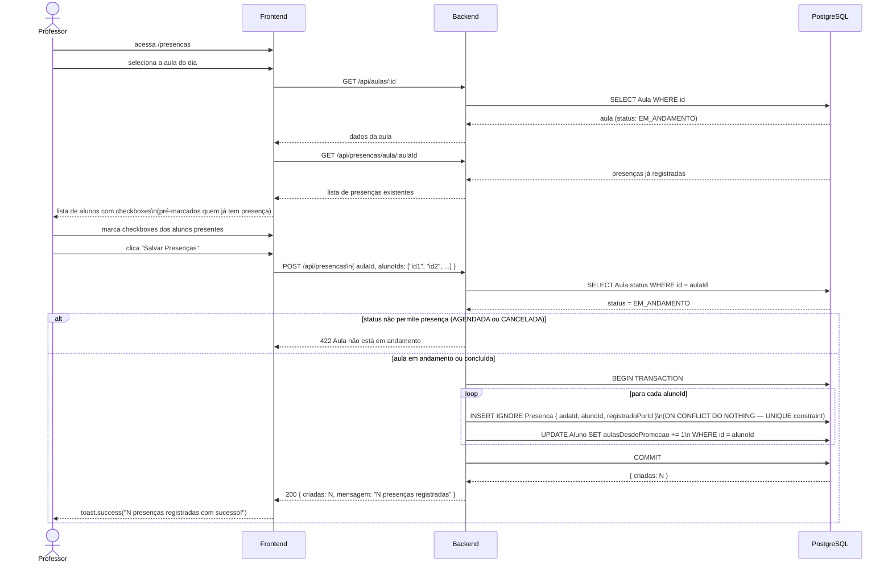
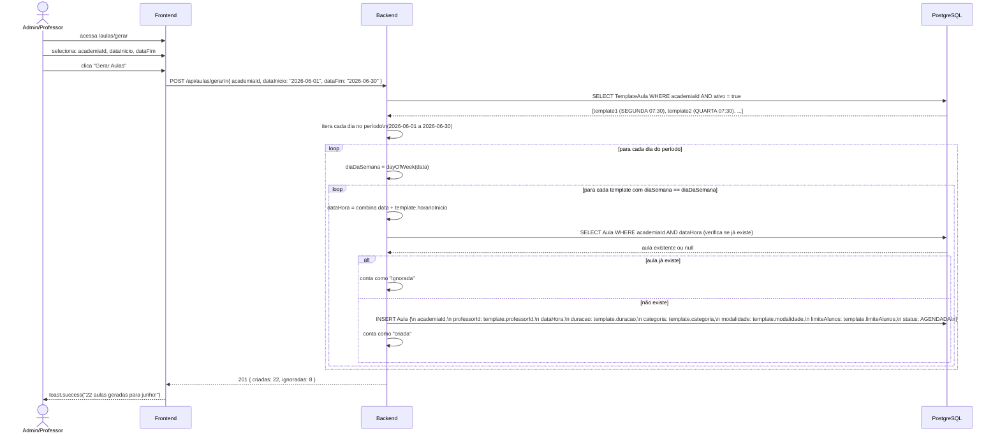

# Sequence Diagrams — Fluxos Críticos do Sistema

Diagramas de sequência para os fluxos mais complexos do sistema. Use como referência ao implementar, testar ou depurar estes fluxos.

> Renderização: GitHub, VS Code + extensão "Markdown Preview Mermaid Support", ou mermaid.live

---

## 1. Autenticação — Login + Refresh automático de token

---

## 2. Reserva de Aula — Criação + Fila de Espera + Promoção

---

## 3. Aprovação de Pré-cadastro Público

---

## 4. Geração Automática de Mensalidades (Cron diário 6h)

---

## 5. Registrar Presença em Aula

---

## 6. Geração de Aulas a partir de Templates

