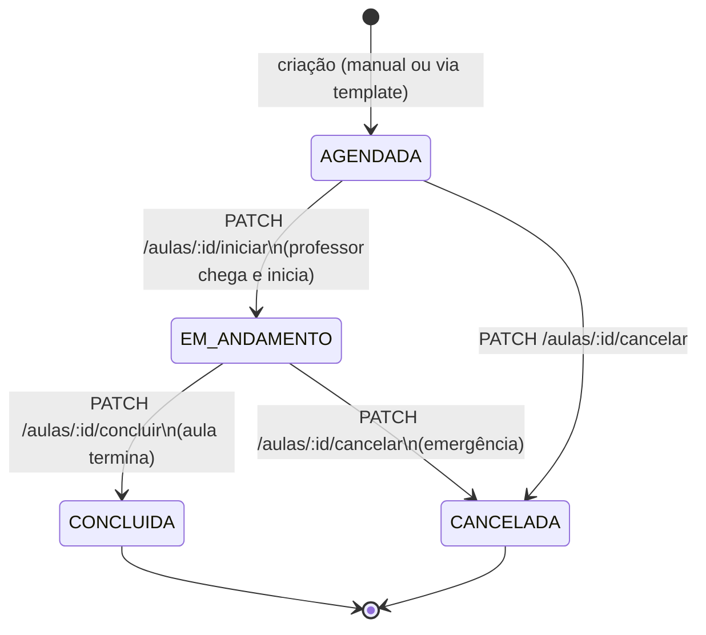
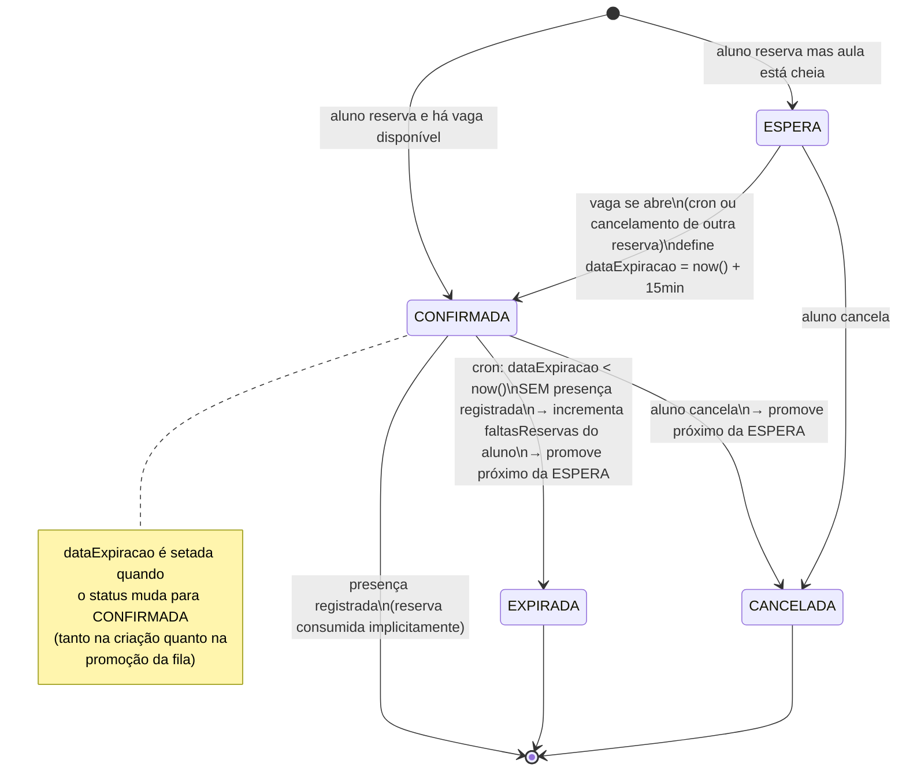
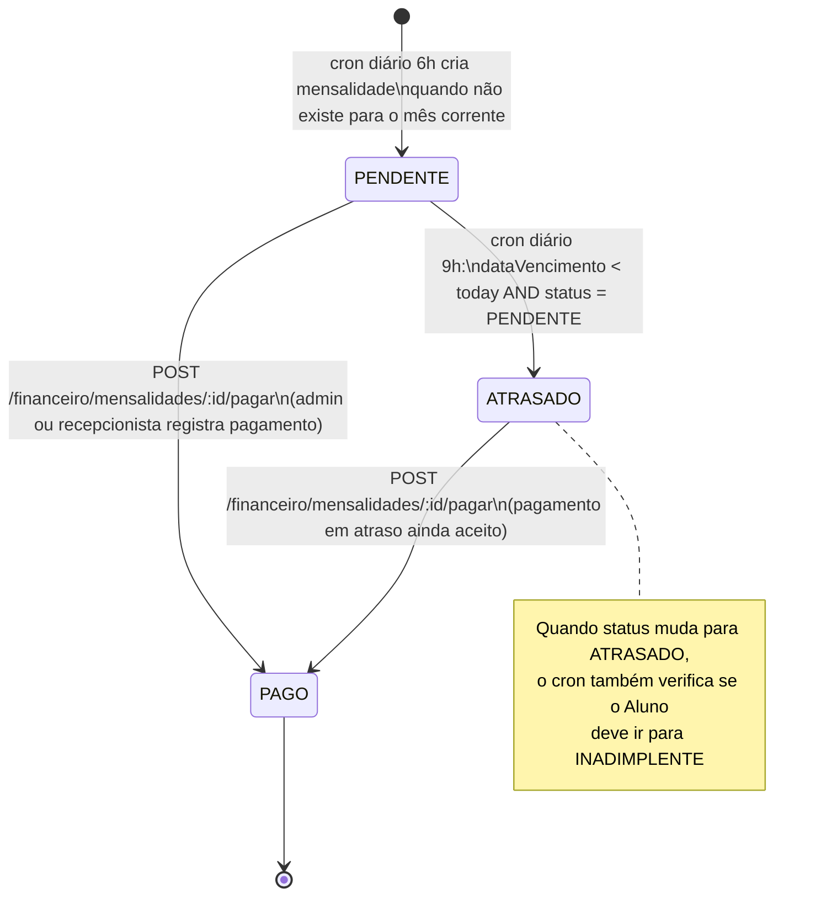
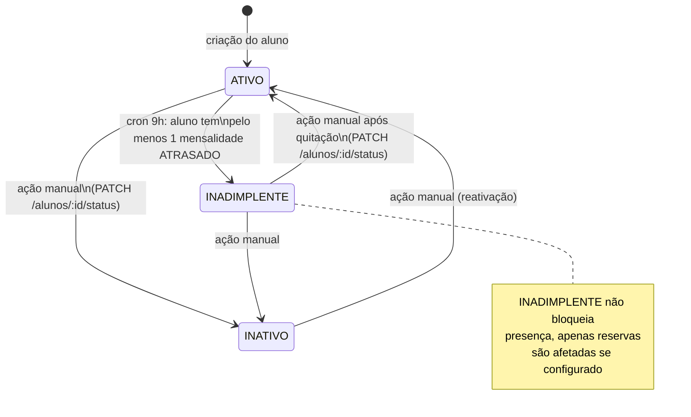
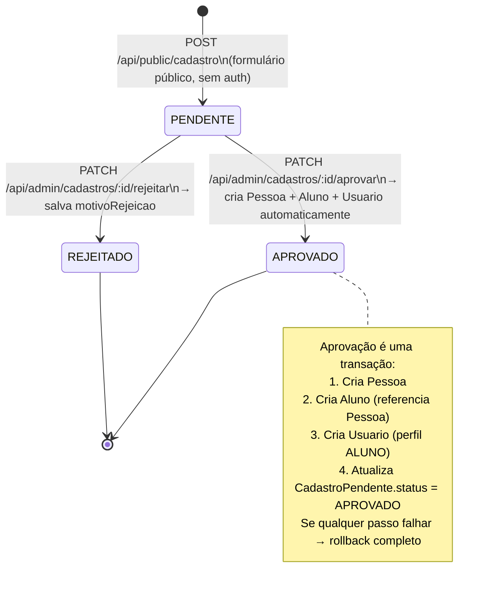
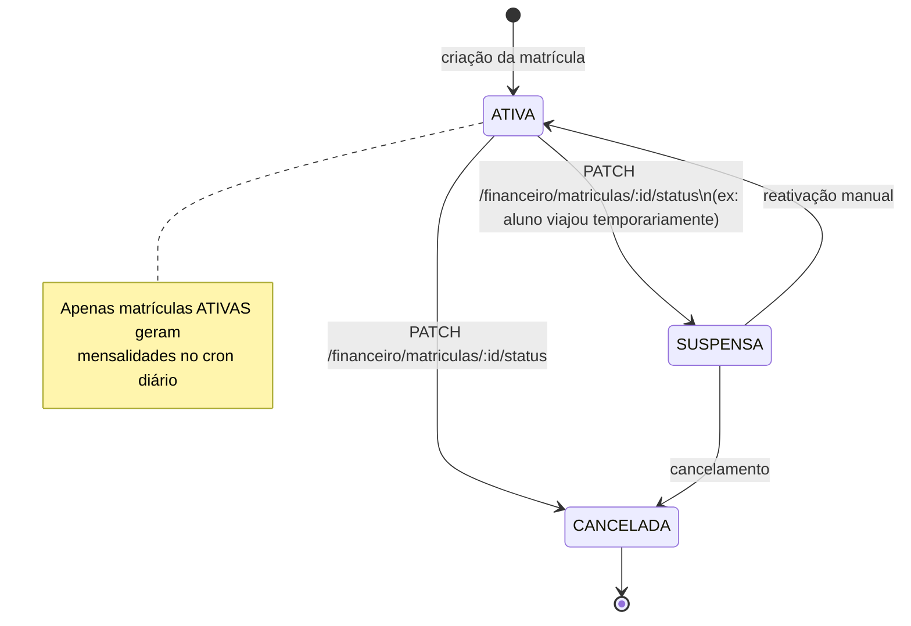

# State Machines — Máquinas de Estado

Diagramas de estado para todas as entidades com ciclo de vida complexo. Use estes diagramas como referência ao implementar validações de transição e ao escrever testes.

> Renderização: GitHub, VS Code + extensão "Markdown Preview Mermaid Support", ou mermaid.live

---

## 1. Aula (`StatusAula`)

**Regras de transição:**
- Presença só pode ser registrada em aula `EM_ANDAMENTO` ou `CONCLUIDA`
- Reservas só podem ser criadas em aulas `AGENDADA`
- Cancelar uma aula `AGENDADA` deve liberar todas as reservas `CONFIRMADA` (promovendo a fila)
- Não há rollback: `CONCLUIDA` e `CANCELADA` são estados finais

---

## 2. Reserva (`StatusReserva`)

**Regras críticas:**
- `UNIQUE(aulaId, alunoId)` — um aluno só pode ter uma reserva por aula
- Aluno com `faltasReservas >= LIMITE_FALTAS_RESERVA` não pode criar nova reserva
- `posicaoFila` só existe para reservas em `ESPERA`; é recalculada quando alguém sai da fila
- Promoção da fila é sequencial: sempre o menor `posicaoFila` é promovido primeiro

---

## 3. Mensalidade (`StatusMensalidade`)

**Regras:**
- `UNIQUE(matriculaId, mesReferencia)` — idempotente: cron pode rodar várias vezes sem duplicar
- Mensalidade `PAGO` é **imutável** — não pode ser revertida para `PENDENTE` ou `ATRASADO`
- Pagamento de mensalidade `ATRASADO` não muda automaticamente o status do Aluno para `ATIVO` — isso é uma ação manual separada

---

## 4. Aluno — Status (`StatusAluno`)

**Regras:**
- A transição para `INADIMPLENTE` é automática (cron) mas a reversão para `ATIVO` é **sempre manual**
- Um aluno `INATIVO` não deve aparecer nas listagens padrão (filtrar por `status = ATIVO`)

---

## 5. Cadastro Pendente (`StatusCadastro`)

**Regras:**
- `email` e `cpf` são únicos no `CadastroPendente` — um interessado não pode se cadastrar duas vezes
- Após aprovação, `email` e `cpf` migram para `Pessoa` — conflito com `Pessoa` existente deve ser tratado antes de aprovar
- `REJEITADO` é final — não é possível reaprovar; o interessado deve fazer novo cadastro

---

## 6. Matrícula (`StatusMatricula`)

**Regras:**
- `SUSPENSA` para o relógio financeiro: mensalidades não são geradas enquanto suspenso
- `CANCELADA` é quase-final: para fins legais, registros históricos são mantidos
- Um aluno pode ter múltiplas matrículas ao longo do tempo (histórico)

---

## Resumo das transições automáticas (Crons)

| Cron | Horário | O que faz |
|------|---------|-----------|
| Gerar mensalidades | 6h diário | `Matricula.ATIVA` → cria `Mensalidade.PENDENTE` para o mês corrente |
| Expirar reservas | A cada 15min | `Reserva.CONFIRMADA` expirada → `EXPIRADA`; promove próximo `ESPERA` → `CONFIRMADA` |
| Verificar inadimplência | 9h diário | `Mensalidade.PENDENTE` vencida → `ATRASADO`; `Aluno` com `ATRASADO` → `INADIMPLENTE` |
